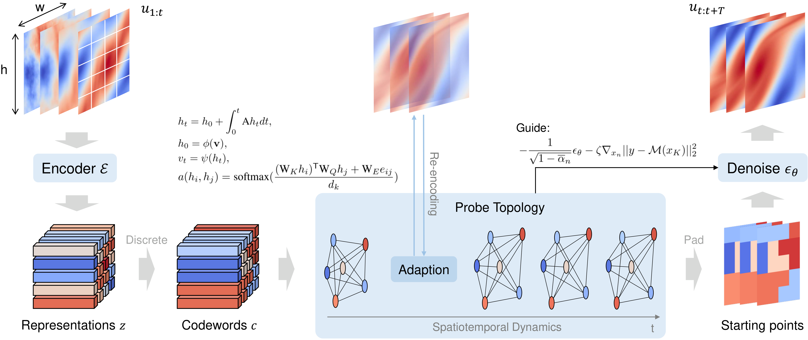

# 🌊 Sparse Diffusion Autoencoder for Test-time Adapting Prediction of Spatiotemporal Dynamics

Thank you for reviewing our **Neurips 2025** manuscript: 📄 *"Sparse Diffusion Autoencoder for Test-time Adapting Prediction of Spatiotemporal Dynamics"*

This repository contains the implementation of **SparseDiff**, a novel approach for learning and predicting the evolution of complex dynamical systems using multiscale diffusion-based autoencoders.




## 🚀 Quick Start

### 📦 Required Dependencies

Ensure the following packages are installed before running the code:

```
pip install tqdm yaml torch torchdiffeq ema_pytorch
```


### 🏃 Running the Model (Example: SH System)

1️⃣ **Download Dataset** 📂: [Google Drive](https://drive.google.com/drive/folders/1i2A_Bw3mUXcsInx8DvZOaOT7vO57-p9L?usp=sharing)

Shape of the data:  (num_trajectories, steps, channel, x_dim, y_dim)

- uv.npy: (100, 100, 1, 128, 128)

- uv_test.npy: (50, 100, 1, 128, 128)

2️⃣ **Run the model**:

- Single GPU / CPU:

  ```sh
  python run.py
  ```

- Multi-GPU (with AMP support):

  ```sh
  python -m torch.distributed.run --master_port=25640 --nproc_per_node=8 train.py --use_amp --multi_gpu --system sh
  ```


## 📁 Repository Structure

```sh
.
├── README.md
├── config
│   └── SH.yaml
├── datasets.py
├── model
│   ├── __init__.py
│   ├── block.py
│   ├── common.py
│   ├── DDPM.py
│   ├── grand_predictor.py
│   ├── unet.py
│   └── vq_vae.py
├── train.py
└── utils.py
```


## 📌 Notes

- This implementation provides a **demo using the SH system** as an example. (Full version will be released after acceptance)
- Supports **both single-GPU and multi-GPU training**.
- Configuration files are stored in the `config/` directory.
- For questions regarding reproducibility or additional details, please refer to our manuscript.
